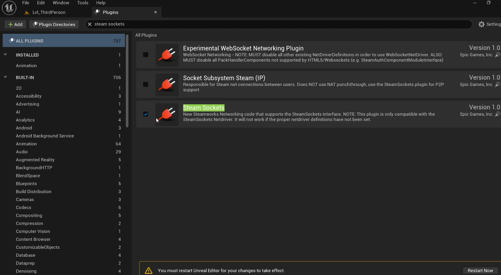

This plugin uses the Steam Online Subsystem for multiplayer functionality, and works with UE4.27-UE5+. 

## Setup

**NOTE:** This documentation covers setup on Windows and Linux only, not MacOS.

First clone this repo or download a ZIP and extract the folder. You'll want to drag the Plugins folder into your project's main directory. If you already have a Plugins folder present in your directory, drag the MultiplayerSessions folder located in the downloaded Plugins folder into your existing Plugins folder.


You'll then need to make sure your project has these plugins enabled:
- Online Subsystem
- Online Subsystem Steam
- Steam Sockets

To enable them, in your editor window click on "Edit" on the top left corner and "Plugins" in the drop down menu. 


A plugins window should appear, search "Online Subsystem", "Online Subsystem Steam", and "Steam Sockets" and ensure those plugins are enabled. You may be prompted to restart your editor after enabling them.





After enabling those plugins and restarting the editor you'll want to build the modules from the plugin. To do that, first close the editor then open the project in an IDE of your choice (I recommend using Rider or Visual Studio as they have native support for Unreal Engine) and click build solution.

Once you build the modules, you'll need to modify some `.ini` files. Navigate to the Config folder in your project's main directory and find the `DefaultEngine.ini` and `DefaultGame.ini` files.

Example path: `[Project]/Config/DefaultEngine.ini` and `DefaultGame.ini`.

Add the following lines to the bottom of your project’s `DefaultEngine.ini` file.

```ini
[/Script/Engine.GameEngine]
!NetDriverDefinitions=ClearArray
+NetDriverDefinitions=(DefName="GameNetDriver",DriverClassName="/Script/SteamSockets.SteamSocketsNetDriver",DriverClassNameFallback="OnlineSubsystemUtils.IpNetDriver")

[OnlineSubsystem]
DefaultPlatformService=Steam

[OnlineSubsystemSteam]
bEnabled=true
SteamDevAppId=480
bInitServerOnClient=true
bAllowP2PPacketRelay=true
P2PConnectionTimeout=90

[/Script/OnlineSubsystemSteam.SteamNetDriver]
NetConnectionClassName="OnlineSubsystemSteam.SteamNetConnection"

[OnlineSubsystemUtils]
IpNetDriverClassName="/Script/OnlineSubsystemUtils.IpNetDriver"
```

> `SteamDevAppId=480` is Steam’s test App ID. Replace it with your own Steam App ID if you have one.


Now add the following lines to your project’s `DefaultGame.ini` file.

```ini
[/Script/Engine.GameSession]
MaxPlayers=100
```

> The value for 'MaxPlayers' is set as an example, you can change it to whatever your project needs.

After adding these lines to the specified '.ini' files, you'll need to build your project again using your IDE. **Note:** When building your project, make sure the editor is closed to avoid compiling issues. 

Once built, delete the folders: `Binaries`, `Intermediate`, and `Saved` in your project's main directory. 

Then regenerate projects files:
- On Windows, right click on the .uproject executable and click generate projects files.
- On Linux, run the GenerateProjectFiles.sh script (found in the Unreal Engine directory, e.g., UnrealEngine-4.27/./GenerateProjectFiles.sh) on the .uproject executable of your project.

Linux example command: /Path/To/UnrealEngineDir/./GenerateProjectFiles.sh /Path/To/ProjectDir/Project.uproject
 
Once you have regenerated project files, rebuild your project again. If everything builds successfully the plugin is installed and ready to use. 

