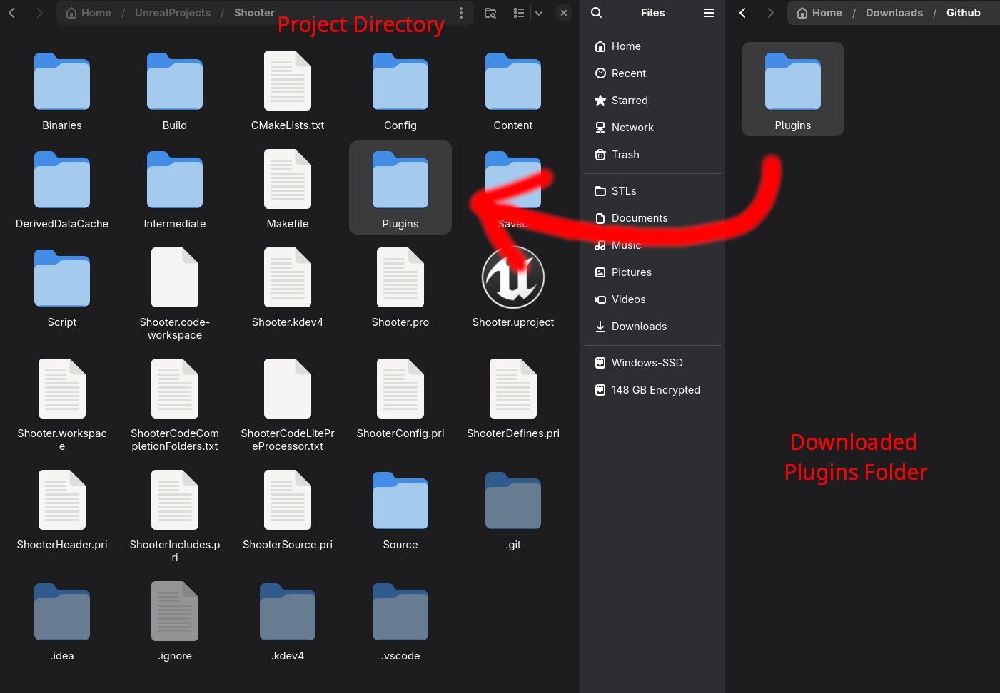
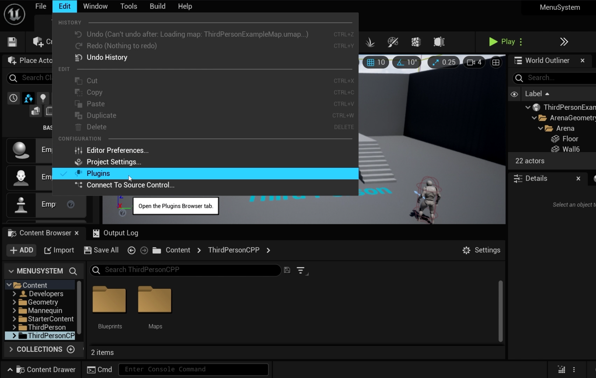
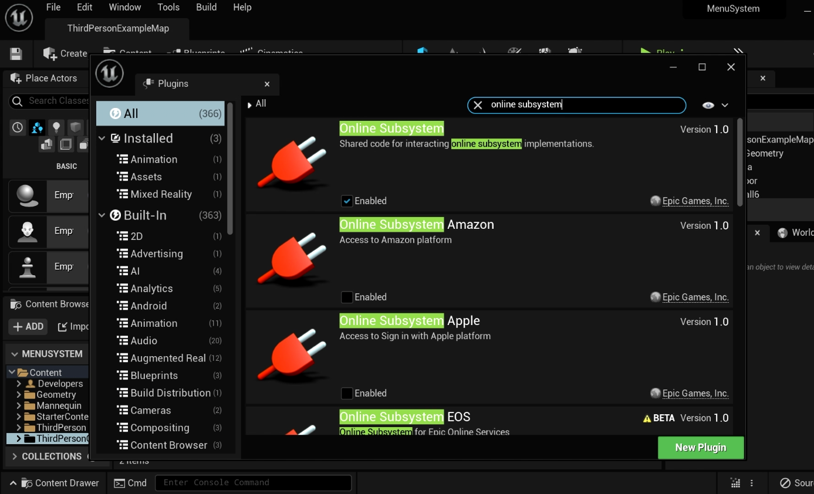
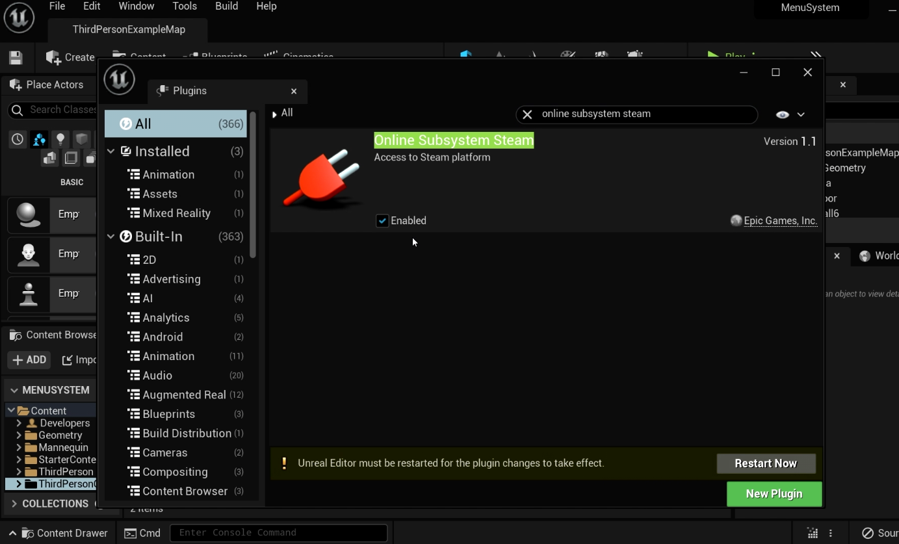

# Multiplayer Plugin Setup

This plugin uses the Steam Online Subsystem for multiplayer functionality, and works with UE4.27-UE5+. 

## Setup
 
First clone this repo or download a ZIP and extract the folder. You'll want to drag the Plugins folder into your projects main directory. If you already have a Plugins folder present in your project, drag the MultiplayerSessions folder into your Plugins folder.



You'll then need to make sure your project has these plugins enabled:
- Online Subsystem
- Online Subsystem Steam

To enable them, in your editor window click on "Edit" on the top left corner and "Plugins" in the drop down menu. 



A plugins window should appear, search "Online Subsystem" and "Online Subsystem Steam" and ensure those plugins are enbaled. You may be prompted to restart your editor after enabling them.





After enabling those plugins and restarting the editor, you'll need to modify some `.ini` files in your project. Navigate to the Config folder in your project's main directory and find the `DefaultEngine.ini` and `DefaultGame.ini` files. 

Example path: `[Project]/Config/DefaultEngine.ini` and `DefaultGame.ini`.

Add the following lines to the bottom of your project’s `DefaultEngine.ini` file.

```ini
[/Script/Engine.GameEngine]
!NetDriverDefinitions=ClearArray
+NetDriverDefinitions=(DefName="GameNetDriver",DriverClassName="/Script/SteamSockets.SteamSocketsNetDriver",DriverClassNameFallback="OnlineSubsystemUtils.IpNetDriver")

[OnlineSubsystem]
DefaultPlatformService=Steam

[OnlineSubsystemSteam]
bEnabled=true
SteamDevAppId=480
bInitServerOnClient=true
bAllowP2PPacketRelay=true
P2PConnectionTimeout=90

[/Script/OnlineSubsystemSteam.SteamNetDriver]
NetConnectionClassName="OnlineSubsystemSteam.SteamNetConnection"

[OnlineSubsystemUtils]
IpNetDriverClassName="/Script/OnlineSubsystemUtils.IpNetDriver"
```

> `SteamDevAppId=480` is Steam’s test App ID. Replace it with your own Steam App ID if you have one.


Now add the following lines to your project’s `DefaultGame.ini` file.

```ini
[/Script/Engine.GameSession]
MaxPlayers=100
```

> The value for 'MaxPlayers' is set as an example, you can change it to whatever your project needs.
